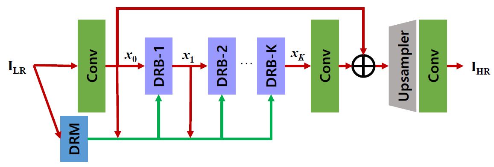
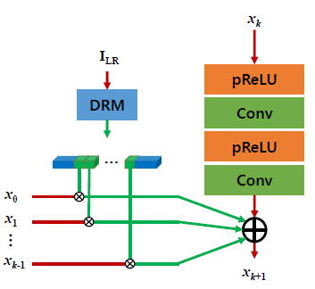
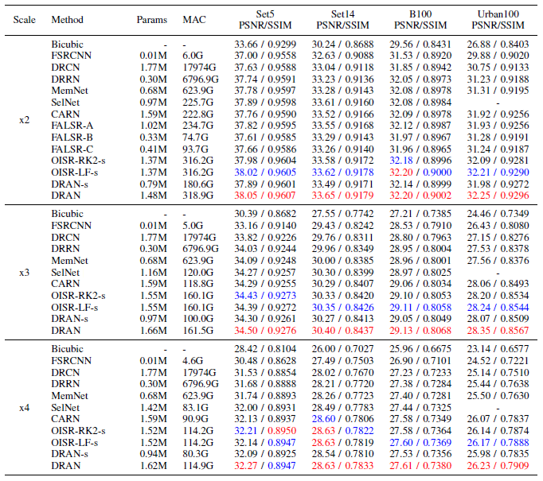

# DRAN

# Single Image Super-Resolution with Dynamic Residual Connection

Karam Park, Jae Woong Soh, and Nam Ik Cho

This is our project repository for ICPR 2021. Our paper was published in ICPR 2021.
If you find our work useful in your research or publication, please cite our work:

[1] Park, Karam, Jae Woong Soh, and Nam Ik Cho. "Single Image Super-Resolution with Dynamic Residual Connection." 2020 25th International Conference on Pattern Recognition (ICPR). IEEE, 2021.

```
@inproceedings{park2021single,
  title={Single Image Super-Resolution with Dynamic Residual Connection},
  author={Park, Karam and Soh, Jae Woong and Cho, Nam Ik},
  booktitle={2020 25th International Conference on Pattern Recognition (ICPR)},
  pages={1--8},
  year={2021},
  organization={IEEE}
}
```

## Environments
- Ubuntu 18.04
- [Tensorflow 1.8](http://www.tensorflow.org/)
- CUDA 9.0 & cuDNN 7.1
- Python 3.6

## Abstract

Deep convolutional neural networks have shown significant improvement in the single image super-resolution (SISR) field. Recently, there have been attempts to solve the SISR problem using lightweight networks, considering limited computational resources for real-world applications. Especially for lightweight networks, balancing between parameter demand and performance is very difficult to adjust, and most lightweight SISR networks are manually designed based on a huge number of brute-force experiments. Besides, a critical key to the network performance relies on the skip connection of building blocks that are repeatedly in the architecture. Notably, in previous works, these connections are pre-defined and manually determined by human researchers. Hence, they are less flexible to the input image statistics, and there can be a better solution for the given number of parameters. Therefore, we focus on the automated design of networks regarding the connection of basic building blocks (residual networks), and as a result, propose a dynamic residual attention network (DRAN). The proposed method allows the network to dynamically select residual paths depending on the input image, based on the idea of attention mechanism. For this, we design a dynamic residual module that determines the residual paths between the basic building blocks for the given input image. By finding optimal residual paths between the blocks, the network can selectively bypass informative features needed to reconstruct the target high-resolution (HR) image.

## Proposed Method

### Overall Structure
<p align="center"></p>

As shown in the figure above, DRAN consists of five main parts: two convolution layers (Conv) at the input and output side each, set of dynamic residual blocks (DRBs), where the DRB is our basic building block, the upsampler, and the DRM. The first Conv performs shallow feature extraction, and the set of DRBs extracts deep features, the upsampler and output-side Conv reconstructs the HR image from the features, and DRM controls feature connections.

### Building Block
<p align="center"></p>

DRB selectively accepts necessary information from preceding DRBs and sends it to the following DRB. This selection of information is controlled by DRM, which decides whole residual paths in the network.

## Experimental Results

<p align="center"></p>

The results are evaluated with the average PSNR (dB) and SSIM on Y channel of YCbCr colorspace.
<font color="red">Red </font> color denotes the best results and <font color ="blue"> blue </font> denotes the second best.

## Visualized Results

<p align="center"></p>

## Guidelines for Codes

**Requisites should be installed beforehand.**

### Test

[Options]
```
python test.py --gpu [GPU_number] --scale [xN] --dataset [Dataset]

--gpu: The number designates the index of GPU which is going to be used. [Default 0]
--scale: x2, x3 or x4
--dataset: Dataset to use. Set5, Set14, BSDS100 or Urban100

```
[An example of test codes]

```
python test.py --gpu 0 --scale x2 --dataset Set5

```
